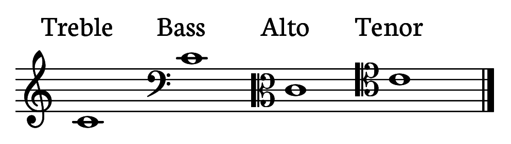

**Notes**

When written on a staff, a note indicates a pitch and rhythmic value. The notation consists of a *notehead* (either empty or filled in), and optionally can include a stem, beam, dot, or flag. 

**Staff**

Notes are can't convey their pitch information without being placed on a staff. A staff consists of five horizontal lines, evenly spaced. The plural of staff is *staves*.

**Clefs**

Notes *still* can't convey their pitch information if the staff doesn't include a clef. A clef indicates which pitches are assigned to the lines and spaces on a staff. The two most commonly used clefs are the *treble* and *bass* clef; others that you'll see relatively frequently are *alto* and *tenor* clef. 

Here is the pitch C4 placed on the treble, bass, alto, and tenor clefs.

**Grand staff**

The grand staff consists of two staves, one that uses a treble clef, and one that uses a bass clef. The staves are connected by a curly brace. Grand staves are used frequently for notating piano music and other polyphonic instruments. 

**Ledger lines**

When the music's range exceeds what can be written on the staff, extra lines are drawn so that we can still clearly read the pitch. These extra lines are called *ledger lines.* In the example below, From Haydn's Piano Sonata in G (Hob. XVI: 39), Ab5 occurs just above the treble staff in the right hand, and G3 and B3 occur just below the treble staff in the left hand.

**Accidentals**

Accidentals are used to indicate when a pitch has been raised or lowered. They are written to the *left* of the pitch. 
