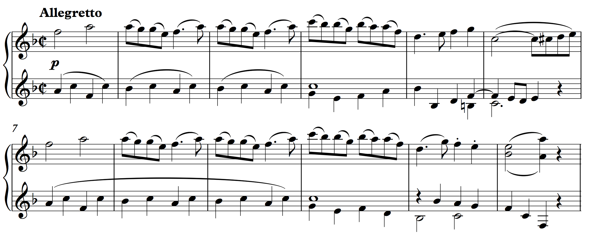

For many different reasons, a great deal of music written in the late eighteenth and nineteenth centuries exhibits metric patterning, at many different levels of [hypermeter](http://courses.music.indiana.edu/rhythm/illustrations/hypermeter.html), that is duple in structure. Such was the tendency in the nineteenth century that William Rothstein, in [*Phrase Rhythm in Tonal Music*](https://openlibrary.org/works/OL4649619W/Phrase_rhythm_in_tonal_music), has memorably dubbed this "the Great Nineteenth- Century Rhythm Problem." A danger, Rothstein says,
<blockquote>endemic in 19th-century music, of too unrelievedly duple a hypermetrical pattern, of too consistent and unvarying a phrase structure—the danger, in short, of submitting too complacently to 'the tyranny of the four-measure phrase.'</blockquote>

Music in the classical tradition was quite often less subservient to the two-bar unit. While this topic has been the subject of a great deal of musical theoretical exploration, here we will concentrate on a simple and common type of *phrase expansion*. 

##Sub-phrase Expansion##

When a two-measure basic idea or contrasting idea is expanded, that expansion is often accomplished through simple repetition within the basic idea: a motive or other small melodic figure is repeated, either exactly or with simple embellishment, causing the overall length of the sub-phrase to be larger than the expected.  

<figure>	
  
  <figcaption>Sub-phrase Expansion: Mozart, Rondo, K. 494, mm. 1–12</figcaption>
</figure>
	
<iframe src="https://embed.spotify.com/?uri=spotify:track:78LK9tbF0jwOd4PYtk42WD" width="300" height="80" frameborder="0" allowtransparency="true"></iframe>
	
Mozart's Rondo in F begins with a simple [period](period.html). A half cadence in m. 6 is followed by a consequent phrase that ends with a PAC in m. 12. The theme’s exceptional length is caused in part by an *expansion* of the initial basic idea: in m. 3, the piano repeats the motive from m. 2. One could imagine a simple recomposition of the passage, omitting m. 3, that would restore the sub-phrase to its normative length.

Notice that the contrasting idea are different. While at three bars they are longer than we expect, it is *less clear* if the greater length is due to *expansion.* There is *no echo repetition,* and it's difficult to imagine a two-measure recomposition of the passage that wouldn't destroy some aspect of its melodic or harmonic structure. 

Interestingly, Mozart's three-bar contrasting idea matches the three bar, expanded basic idea. Because two odd lengths always create an even length, the three bar sub-phrases here create a phrase with a duple (albeit six bar) length.

##Phrase Expansion##

Like sub-phrase expansion, phrases are generally expanded through repetition. Most often, this repetition happens in the terminating phrase of a theme (either consequent or continuation). Such expansions are quite expressive because they delay the expected cadence.
		
**Beethoven, Piano Sonata, Op. 2, No. 3** 

	
<iframe src="https://embed.spotify.com/?uri=spotify:track:5wi0p2gHWFYSwnjgHSYEP3" width="300" height="80" frameborder="0" allowtransparency="true"></iframe>
	
In this example, measure 1–8 create a sentence whose basic idea is fragmented in m. 5–6. At the moment of expected cadence in m. 8, an IAC emerges instead of a PAC. Subsequently, the entire continuation is repeated, thus *expanding* the continuation phrase to nine bars in total.

Note that it is lack of *satisfactory cadential closure* that gave rise to the expansion. This is the most common musical reason for phrase expansions. In addition to IACs, deceptive cadences can motivate expanded phrases, as well. In many other examples, an expected cadence never materializes at all. In these passages, the cadence has been *evaded.* When an evaded cadence is followed by the repetition of a phrase, the expansion is an example of what Janet Schmalfeldt has termed the "one more time" technique. 

**Mozart, Piano Sonata, Piano Sonata in C major, K. 309, iii**

<iframe src="https://embed.spotify.com/?uri=spotify:track:7DsGTbl7EABrY5GK6Dza9P" width="300" height="80" frameborder="0" allowtransparency="true"></iframe>

Following an 8-measure sentence ending with a half cadence, a parallel sentence begins in m. 9. We expect this sentence to conclude in m. 16 with a PAC, creating a large compound period. But the latter phrase *does not* end with a PAC. Rather, the expected cadence in m. 16 never materializes. Instead, the cadence is *evaded,* and the entire continuation phrase is repeated "one more time," concluding with a PAC in m. 19. 

##Non-standard Lengths
**First, an important disclaimer.**  An expansion can usually be said to occur when the size of a sub-phrase or phrase has been increased, often resulting in a phrase unit (a phrase, sub-phrase, and so on) with a non-standard length. But an irregular lengths is not necessarily indicative of a phrase expansion. 

For example, listen a few times to the first 30 seconds of the following passage, from Mozart's String Quintet in C major, K. 515. Its main theme is a [compound sentence](compoundSentence.html). The theme's [presentation](themeFunctions.html#presentation) has three basic ideas (at 0:00, 0:09, and 0:16), each of which is constructed as a [compound basic idea](hybridThemes.html#compound-basic-idea)that contains a basic idea followed by a contrasting one:

<iframe src="https://embed.spotify.com/?uri=spotify%3Atrack%3A0Mkcj2eA2EMqMGfzwCnd0u" width="300" height="380" frameborder="0" allowtransparency="true"></iframe>
   
We hear in this passage that the compound basic ideas are five measures long, each basic idea itself lasting three measures! But *no phrase expansion* has occurred here. The basic idea is simply longer than normal, and perhaps a bit looser feeling as a result. When in doubt, the central question is whether a passage might be recomposed, duple-fied *without* destroying its melodic, harmonic, and motivic structure. If you can, there is a case to be made that an *expansion* is present.

