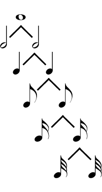

{{ page.title }}
================

Rhythm refers to the combination of long and short durations in time. Durations are notated with either unfilled or filled noteheads. Unfilled noteheads can appear with or without a stem; filled noteheads always appear with a stem. Flags can be added to the stems of filled noteheads; each flag shortens the duration by half. 

**Rests**

Rests represent silence in musical notation. For each durational symbol there exists a corresponding rest. 

**Dots**

A dot occurs after a pitch or a rest, and it increases its duration by half. 

**Ties**

**Tuplets**

