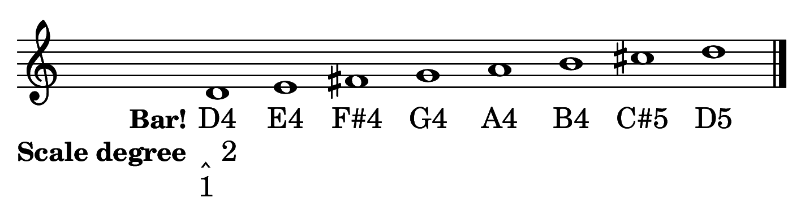

A scale is a succession of pitches ascending or descending in steps. There are two types of steps: *half steps* and *whole steps*. A half step (H) consists of two adjacent pitches on the keyboard. A whole step (W) consists of two half steps. Usually, the pitches in a scale are each notated with different letter names, though this isn't always possible or desirable. 

### The Chromatic Scale ###

The chromatic scale consists entirely of half steps, and uses every pitch on the keyboard within a single octave. Here is the chromatic scale that spans the pitches C4 through C5.

![The chromatic scale][chromaticscale]

### The major scale ###

A major scale, a sound with which you are undoubtedly familiar, consists of seven whole (W) and half (H) steps in the following succession: W-W-H-W-W-W-H. The first pitch of the scale, called the *tonic*, is the pitch upon which the rest of the scale is based. When the scale ascends, the tonic is repeated at the end an octave higher.

Here is the D major scale. It is called the "D major scale" because the pitch D is the *tonic* and is heard at both ends of the scale. 

![The major scale][majorscale]

### Scale degrees and solfège ###

While ISO notation allows us to label a pitch in its specific register, it is often useful to know where that pitch fits within a given scale. For example, the pitch class D is the first (and last) note of the D-major scale. The pitch class A is the fifth note of the D-major scale. When described in this way, we call the notes *scale degrees*, because they're placed in context of a specific scale. Solfège syllables, [a centuries-old method of teaching pitch and sight singing](http://en.wikipedia.org/wiki/Solfège), can also be used to represent scale degrees (when used in this way, this system is specifically called movable-*do* solfège). 

Scale degrees are labeled with Arabic numerals and carets (^). The illustration below shows a D-major scale and corresponding ISO notation, scale degrees, and solfège syllables.

### The minor scale ###

Another scale with which you are likely very familiar is the minor scale. There are several scales that one might describe as *minor*, all of which have a characteristic third scale degree that is lower than the one found in the major scale. The minor scale most frequently used in tonal music from the Common Practice period is based on the *aeolian mode* (you'll read more about modes later), which is sometimes referred to as the *natural minor* scale. 

The natural minor scale consists of seven whole (W) and half (H) steps in the following succession: W-H-W-W-H-W-W.

![The minor scale][minorscale]

If you play through the above example on the keyboard, you'll notice that the ending lacks the same sense of closure you heard in the major scale. This closure is created in the major scale, in part, by the ascending semitone between *ti* and *do*. Composers often want to have this sense of closure when using the minor mode, too. They're able to achieve this by applying an accidental to the seventh scale degree, raising it by a semitone. If you do this within the context of the natural minor scale, you get something called the *harmonic minor* scale.

[chromaticscale]: Graphics/chromaticscale.png
[majorscale]: Graphics/majorscale.png
[minorscale]: Graphics/minorscale.png
